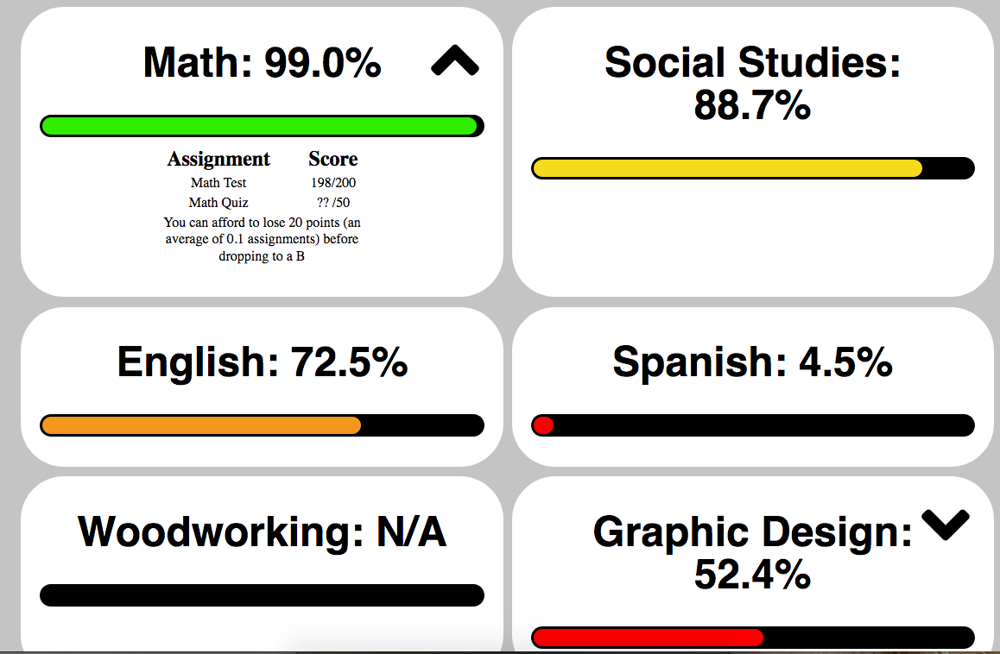

# MyBackpack Grade API/Site

This project is a Flask API/Scraper that takes a user's MyBackpack credentials, then display's their grades in a prettier interface

## Installation and Running
To install, run 
`pip -r requirements.txt`

Then, for a development/test server you can just run `app.py`

`python3 app.py`

Navigate to `0.0.0.0:5000` and you should see the login page.

Go to `0.0.0.0:5000/test`, and you will be able to test the parser and html generator without using real data

Do not use the development/test server for deployment! See [Flask Docs](http://flask.pocoo.org/docs/1.0/deploying/) for more

## Website
Instead of the confusing myBackpack website, this project provides a nice, simplified alternative. (Example Below)



It also displays all assignments and their respective scores, and lets the user know how many points they can afford to lose before dropping to the next letter grade.

If the class is weighted, the "analytics" aren't valid. See the FAQ for more info

There's also an FAQ at /faq

## API Endpoints

#### `json` (POST)
Returns grade data in JSON format
##### Arguments
   * `username` (String): The user's myBackpack username
   * `password` (String): The user's myBackpack password
##### JSON Example
````json
[
	{
		"analytics": {
			"drop": "You can afford to lose 1 points (an average of 0.06 assignments) before dropping to a B",
			"gradeWithMissing":"Counting missing assignments, you have a 100%"
		},
		"assignments": [
			{
				"due": "10/5/2018",
				"earned": "17",
				"name": "Photosynthesis Quiz",
				"possible": "17",
				"score": "17/17"
			}
		],
		"class": "AP Biology",
		"grade": "100%"
	}
]
````

## Contributing/Issues

If you have a suggestion or error, please report it in [the issues](https://github.com/katzrkool/mybackpack/issues)

If you want to contribute, feel free to submit a pull request. I'd appreciate it!