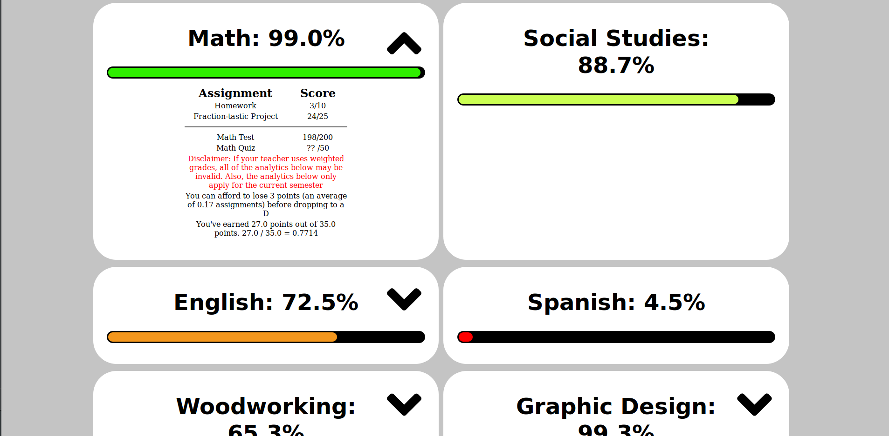

# MyBackpack Grade Site
A client to view grades from MyBackpack in a simplified, prettier interface.
## This project is no longer maintained

## Installation

This project uses [pipenv](https://pipenv.readthedocs.io/en/latest/) to manage packages. To install the dependencies, just run `pipenv install`

Run `app.py` and launch `0.0.0.0:5000` in your web browser to see the login page.

`0.0.0.0:5000/test` is available for testing the parser and html generator without using real data.

Don't use the development server for deployment! See [Flask Docs](http://flask.pocoo.org/docs/1.0/deploying/) for more info.

## Website
Instead of the confusing myBackpack website, grades are presented in a cleaner, simpler way. (Example below)



It also displays all assignments and displays their respective scores.

If assignments are available from different semesters, they'll be split by a lovely horizontal line.

Some additional analytics are generated such as how many points one can afford to lose before dropping to the next letter grade, and what grade would result if all assignments were added up manually (to see if a class is weighted).

Unfortunately, if a class is weighted, these analytics are not accurate. See the FAQ more.

There's also an faq available at /faq


## API Endpoints

#### `/api` (POST)
Returns grade data in JSON format
##### Arguments
   * `username` (String): The user's myBackpack username
   * `password` (String): The user's myBackpack password
##### JSON Example

````json
[
	{
		"analytics": {
			"drop": "You can afford to lose 1 points (an average of 0.06 assignments) before dropping to a B",
			"points": "You've earned 17.0 points out of 17.0 points.   17.0 / 17.0 = 1.0"
		},
		"assignments": [
			{
				"due": "10/5/2018",
				"earned": "17",
				"name": "Photosynthesis Quiz",
				"possible": "17",
				"score": "17/17"
			}
		],
		"class": "AP Biology",
		"grade": "100%",
		"earned": 17,
		"possible": 17
	}
]
````

Sometimes, analytics aren't available for various reasons, and if so, the analytics object will only have one item in it, an 'info' item. See the example below.

````json
{
    "analytics": {
			"info": "Analytics have been temporarily turned off because the Semester 2 transition broke them all."
		}
}
````

## Contributing/Issues

If you have a suggestion or error, please report it in [the issues](https://github.com/katzrkool/mybackpack/issues)

If you want to contribute, feel free to submit a pull request. I'd appreciate it!
